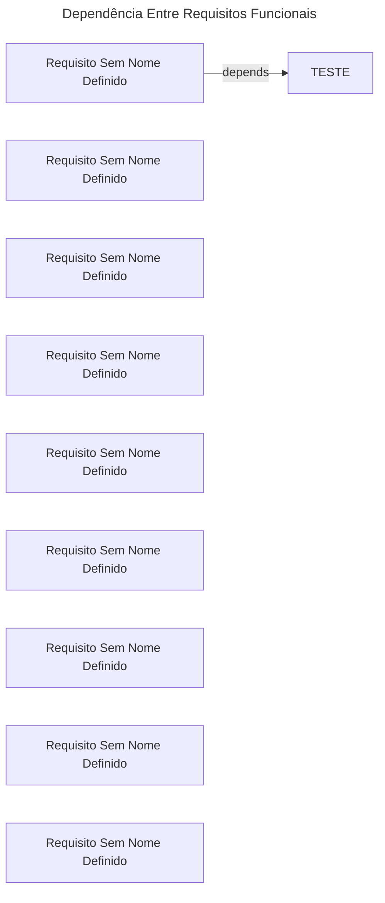

# Requisitos Funcionais
Tabela 1: Requisitos Funcionais do Módulo

|ID|Nome|Descrição|Dependências|Prioridade|
|-|-|-|-|-|
|RF01|TESTE|O sistema deve permitir que usuários se cadastrem com nome, email e senha||Alta|
|RF02|Requisito Sem Nome Definido|O sistema deve permitir autenticação dos usuários|RF01|Alta|
|RF03|Requisito Sem Nome Definido|O sistema deve permitir que o usuário crie novas tarefas||Alta|
|RF04|Requisito Sem Nome Definido|O sistema deve permitir que o usuário edite tarefas existentes||Alta|
|RF05|Requisito Sem Nome Definido|O sistema deve permitir que o usuário exclua tarefas||Alta|
|RF06|Requisito Sem Nome Definido|O sistema deve listar as tarefas do usuário||Alta|
|RF07|Requisito Sem Nome Definido|O sistema deve permitir alterar o status das tarefas||Alta|
|RF08|Requisito Sem Nome Definido|O sistema deve permitir que o usuário crie e gerencie categorias||Média|
|RF09|Requisito Sem Nome Definido|O sistema deve permitir filtrar tarefas por status, data e categoria||Média|
|RF10|Requisito Sem Nome Definido|O sistema pode enviar notificações sobre tarefas pendentes ou próximas do vencimento||Baixa|

Autor: Autoria Própria

# Requisitos Não Funcionais
Tabela 2: Requisitos Não Funcionais do Módulo

|ID|Nome|Descrição|Dependências|Prioridade|
|-|-|-|-|-|
|RNF01|Requisito Sem Nome Definido|O sistema deve ter autenticação segura com criptografia de senha|RF02|Alta|
|RNF02|Requisito Sem Nome Definido|Deve ser uma aplicação responsiva, funcionando bem em desktop e mobile||Alta|
|RNF03|Requisito Sem Nome Definido|O backend deve ser desenvolvido em Django||Alta|
|RNF04|Requisito Sem Nome Definido|O frontend deve ser desenvolvido em React||Alta|
|RNF05|Requisito Sem Nome Definido|O sistema deve suportar pelo menos 100 usuários simultâneos||Média|
|RNF06|Requisito Sem Nome Definido|O tempo de resposta das requisições não deve exceder 2 segundos em 95% dos casos||Alta|

Autor: Autoria Própria

# Regras de Negócio
Tabela 3: Regras de Negócio do Módulo

|ID|Nome|Descrição|Dependências|Prioridade|
|-|-|-|-|-|
|BR01|Regra de Teste|Descrição|||

Autor: Autoria Própria

# Grafo de Dependências
Grafo de Fluxo 1: Grafo esquematizado das dependências entre os requisitos funcionais

Fonte: Autoria Própria